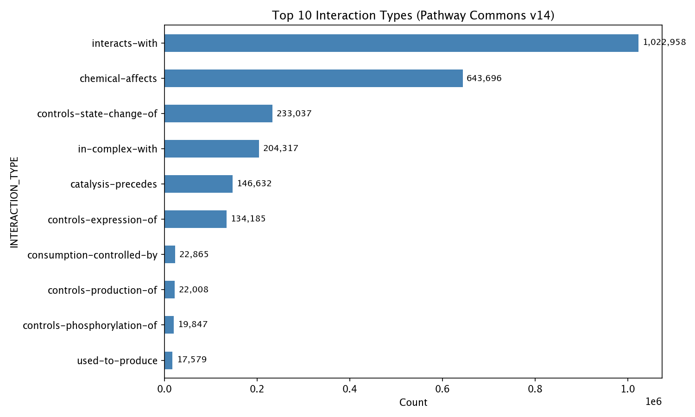
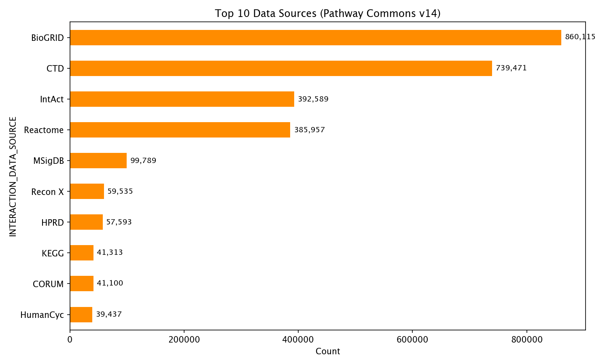
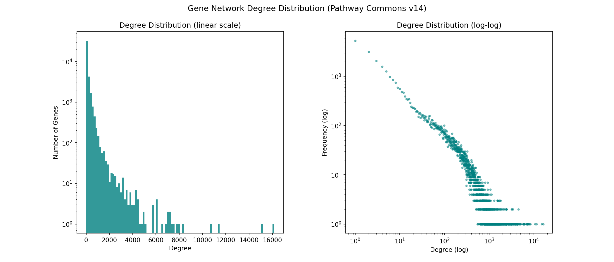

# Pathway Commons v14 — Data Analysis Report

## Dataset Overview
- **Source:** Pathway Commons v14 (`pc-hgnc.txt.gz` from `download.baderlab.org`)
- **Format:** Tab-separated, gzipped (110 MB compressed, ~788 MB uncompressed)
- **Total rows:** 2,524,906 (including 40,685 metadata/entity-type rows)
- **Clean interaction rows:** 2,484,221
- **Columns:** `PARTICIPANT_A`, `INTERACTION_TYPE`, `PARTICIPANT_B`, `INTERACTION_DATA_SOURCE`, `INTERACTION_PUBMED_ID`, `PATHWAY_NAMES`, `MEDIATOR_IDS`

## Interaction Types
13 distinct interaction types after filtering metadata. The distribution is heavily concentrated:

- **`interacts-with`** — 1,022,958 (41%) — undirected physical interactions
- **`chemical-affects`** — 643,696 (26%) — chemical-gene relationships
- **`controls-state-change-of`** — 233,037 (9%) — post-translational regulation
- **`in-complex-with`** — 204,317 (8%) — complex membership
- **`catalysis-precedes`** — 146,632 (6%) — sequential enzymatic steps
- **`controls-expression-of`** — 134,185 (5%) — transcriptional regulation
- **`consumption-controlled-by`** — 22,865 (1%)
- **`controls-production-of`** — 22,008 (1%)
- **`controls-phosphorylation-of`** — 19,847 (1%)
- **`used-to-produce`** — 17,579 (1%)
- **`controls-transport-of`** — 8,562 (<1%)
- **`reacts-with`** — 4,593 (<1%)
- **`controls-transport-of-chemical`** — 3,942 (<1%)

## Data Sources
20 primary databases contribute interactions, dominated by:

- **BioGRID** — 860,115 (~31%)
- **CTD** — 739,471 (~27%)
- **IntAct** — 392,589 (~14%)
- **Reactome** — 385,957 (~14%)
- **MSigDB** — 99,789 (~4%)
- **Recon X** — 59,535 (~2%)
- **HPRD** — 57,593 (~2%)
- **KEGG** — 41,313 (~1%)
- **CORUM** — 41,100 (~1%)
- **HumanCyc** — 39,437 (~1%)
- Additional sources: BIND, PANTHER, INOH, NCI-PID, Pathbank, PhosphoSite, DrugBank, DIP, NetPath, Biofactoid

Data sources can be multi-valued (semicolon-separated), indicating an interaction is supported by multiple databases.

## Network Connectivity

### Summary Statistics
- **Unique genes/entities:** 40,684 (includes ChEBI small molecules alongside HGNC gene symbols)
- **Mean degree:** 116.2
- **Median degree:** 20
- **25th percentile:** 3
- **75th percentile:** 116
- **Maximum degree:** 16,161

### Scale-Free Topology
The log-log degree distribution shows an approximately linear decay, consistent with a **power-law / scale-free network**. This means:
- The vast majority of genes have few interaction partners
- A small number of highly connected hubs dominate the network topology
- 75% of nodes have ≤116 connections; 25% have ≤3

### Top 20 Most Connected Nodes

| Rank | Node | Degree | Type |
|------|------|--------|------|
| 1 | chebi:29865 | 16,161 | Small molecule |
| 2 | chebi:39867 | 15,089 | Small molecule |
| 3 | chebi:33216 | 11,454 | Small molecule |
| 4 | chebi:2504 | 10,683 | Small molecule |
| 5 | chebi:4031 | 8,294 | Small molecule |
| 6 | chebi:29678 | 7,951 | Small molecule |
| 7 | chebi:15367 | 7,761 | Small molecule |
| 8 | chebi:46195 | 7,485 | Small molecule |
| 9 | chebi:16469 | 7,305 | Small molecule |
| 10 | chebi:2825 | 7,253 | Small molecule |
| 11 | chebi:28748 | 7,174 | Small molecule |
| 12 | chebi:27899 | 7,103 | Small molecule |
| 13 | **RORA** | **7,078** | **Gene** |
| 14 | chebi:15334 | 6,886 | Small molecule |
| 15 | chebi:79994 | 6,618 | Small molecule |
| 16 | chebi:38940 | 6,111 | Small molecule |
| 17 | **NOG** | **6,087** | **Gene** |
| 18 | chebi:78510 | 6,004 | Small molecule |
| 19 | chebi:23414 | 5,986 | Small molecule |
| 20 | CHEBI:45713 | 5,808 | Small molecule |

The top hubs are predominantly small molecules (ChEBI IDs for water, ATP, cofactors, etc.), which is expected since they participate in many biochemical reactions. The top gene-symbol hubs are **RORA** (7,078) and **NOG** (6,087).

## Data Quality Notes
- **Sparse metadata:** `PATHWAY_NAMES` and `MEDIATOR_IDS` are populated in only a minority of rows
- **Metadata rows:** 40,685 rows contain entity-type information (e.g., `SmallMoleculeReference`, `ProteinReference`) rather than interactions — these should be filtered before graph analysis
- **Mixed entity types:** Participants include both HGNC gene symbols and ChEBI small molecule identifiers, which should be considered when building gene-only networks
- **Multi-source support:** Many interactions are annotated by multiple databases, providing independent evidence and confidence weighting opportunities

## Generated Artifacts
- `data.gz` — raw Pathway Commons v14 data file
- `interaction_types.png` — bar chart of top 10 interaction types
- `data_sources.png` — bar chart of top 10 data sources
- `degree_distribution.png` — dual-panel histogram and log-log scatter of gene degree distribution
- `REPORT.md` — this report
